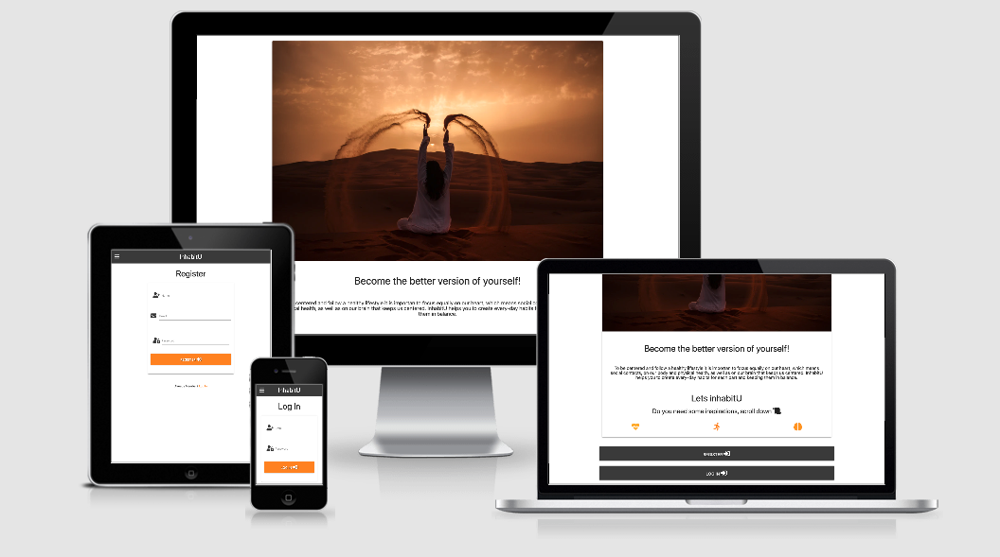

# Milestone Project 3: InhabitU 

## InhabitU
#### InhabitU is an application to facilitate and keep track on a balanced lifestyle. Options to create, edit and keep track on frequent habits in the three categories “Heart”, “Body” and “Brain” make it easy to stay motivated and keep an overview over how well we balance and spend time in the three categories.

## UX
#### The application is made for everyone that feels it hard sometimes to bring the three main categories that define our physical and mental well-being in balance. 
#### In a rushed everyday life, it can be hard to equally set out time on staying fit and healthy (“Body”), spending time with friends and family (“Heart”) as well as being focused and centred in our mind (“Brain”). 
#### Defining and following habits can help to achieve a balance, stay motivated and not forget of one of the categories. InhabitU enables the user to achieve this balance through a habit-based approach. It provides options to create habits for each three categories, edit them according to changing circumstances and keep track in an overview.

### Wireframes
#### For the creation of my wireframes I used the Balsamiqu program (see “technologies used"). Throughout the development of the webpage the wireframes were very helpful for me to reach the final design.
#### I have created mobile wireframes and desktop wireframes.

1. Desktop Wireframes

  - [Home-page](https://github.com/LaiMo2020/InhabitU/blob/master/static/wireframe/desktop.home%20copy.png)
  - [LogIn](https://github.com/LaiMo2020/InhabitU/blob/master/static/wireframe/desktop.login%20.png)

  - [Register](https://github.com/LaiMo2020/InhabitU/blob/master/static/wireframe/desktop.register.png)
 - [Create Habit](https://github.com/LaiMo2020/InhabitU/blob/master/static/wireframe/desktop.create.png)

2. Mobile Wireframes 

  - [Home-page](https://github.com/LaiMo2020/InhabitU/blob/master/static/wireframe/mobile.home.png)
  - [LogIn](https://github.com/LaiMo2020/InhabitU/blob/master/static/wireframe/mobile.login.png)

  - [Register](https://github.com/LaiMo2020/InhabitU/blob/master/static/wireframe/mobile.register.png)
 - [Create Habit](https://github.com/LaiMo2020/InhabitU/blob/master/static/wireframe/mobile.create%20copy.png)

## User stories
- As a user I want to create and edit an overview of my habits, so that I can store and return to my created habit-lists.

  InhabitU enables the user by providing an option to register in the page and create a personal profile

- As a user I want to create new habits, so that I can be more active in a certain category of my life-balance

  InhabitU enables the user in his/her profile with an option to create new habits, linked to the three categories “heart, brain and body” and add them to a personal list of active habits

- As a user I want to define new habits by name and description, so that I can easily remember and return to their purpose

  In the “create a new habit” dialogue the user can give it a name and longer description

- As a user I want to define a start-day for each habit, so that I can stay motivated and get a regularity in my daily life 

  In the “create a new habit” dialogue the user can define a start-day for the habit

- As a user I want to mark certain habits as prioritised, so that I can be remembered on what is important just now 

  In the “create a new habit” dialogue the user can set “prioritize” to the habit he or she creates

- As a user I want to edit a habit, so I can adapt it to new circumstances in my life

  InhabitU enables the user in the “habits” overview with an option to edit existing habits

- As a user I want to delete a habit, so I can get more time to spend on another habit or category

 InhabitU enables the user in the “habits” overview with an option to delete existing habits

## Features

 ### Header– without being logged in
 The section “Home” in the header allows user that are not logged in to get information on a balanced lifestyle. To get started they can choose from options to “log in” or “register” 
 “Log in” allows the user to log in to their profile by filling in their username and password. 
 Pushing “register account “ at the bottom of the log-in dialogue allows the user to reach the “register” dialogue
“Register” allows the user to register a new account by filling in a user name, their e-mail address and define a password. 

### Header– as a logged in user
#### Home
The “+” button allows the user to create a new habit
Icons referring to the three categories enable the user to switch between predefined habits in the three categories by clicking on the icons
Predefined habits in all three categories give inspiration.

#### Create a new habit
The dialogue enables the user to create a custom habit by choosing categories, filling in name, description and start date and choosing if it is prioritized or not.
The “add new habit” button enables the user to add the filled in habit to their list by pushing the button

#### Habits
Provides an overview over all active habits added by the user
The habit-boxes enable the user to delete a habit by pushing “delete”. A pop-up asking if the user is sure to delete protects the user from deleting bye mistake. By pushing yes or no the user can confirm the deleting process.
The habit-boxes enable the user to edit an existing a habit by pushing “edit” 

#### Log out
“Log out” enables the user to log out of his or her profile by pushing the link in the header

### Features Left to Implement
A counter for the habits that helps the user to check off certain activities and follow up their frequency
A statistic overview over habits and their activity

Technologies Used
Jquery
The project uses JQuery to simplify DOM manipulation.

# Technologies Used

### 1. [HTML](https://html.com/)

For the basic structure of the project

### 2. [CSS](http://css.com/)

For the styling and design of the webpage

### 3. [JQuery ](https://jquery.com/) 

 Add dynamic and interactive elements to websites 

### 4.  [materialize](https://materializecss.com/)

Quick and responsive form and method to implement.

### 5. [GitHub](https://github.com/)

Platform to publish the webpage and interact with clients and the coder community

### 6. [Gitpod](https://www.gitpod.io/)

A coding editor with an adapted and easy coding environment

### 7. [GIT](https://git-scm.com/)

For version control. As I changed my mentor during the project phase I created a new repository throughout the process. Many sections I had created during my tutoring with the first mentor were pasted into this new repository. Therefor e GIT was just used a few times. 

### 8. [Flask](https://flask.palletsprojects.com/en/1.1.x/)

A web framework  for Python
### 9. [Font Awesome](https://fontawesome.com/6?next=%2F)

As a resource of icons to style my page
### 10. [Jinja](https://jinja.palletsprojects.com/en/2.11.x/)
A web template engine for python 

### 11. [Chrome DevTools](https://developers.google.com/web/tools/chrome-devtools)

For live editing options while coding the page
### 12. [Balsamiq](https://balsamiq.com/)

To create wireframes
### 13. [Heroku](https://dashboard.heroku.com/apps)
Storing my app.
### 14. [Pyhton](https://www.python.org/)
Backend programmering language.
### 15. [MongoDB](https://www.mongodb.com/)
cross-platform document-oriented database/ NOSQL 

## Testing 

### Testing and review of the webpage

1. I have tested the webpage myself in the following browsers and devices:
- Google Chrome

- Safari
- Iphone XR
- MacBook Air

2. I have sent the webpage to family and friends who tested the page and responsiveness on following browser and devices:
- Google Chrome

- Safari
- iPad
- iPhone SE

### Validation of the code/ Screenshoot 

- [vlaidator/screnshoot/Craete-HTML](https://github.com/LaiMo2020/InhabitU/blob/master/static/Validation/create-html.png)
- [vlaidator/screnshoot/Edit-HTML](https://github.com/LaiMo2020/InhabitU/blob/master/static/Validation/edit-html.png)
- [vlaidator/screnshoot/Login-HTML](https://github.com/LaiMo2020/InhabitU/blob/master/static/Validation/login-html.png)
- [vlaidator/screnshoot/Register-HTML](https://github.com/LaiMo2020/InhabitU/blob/master/static/Validation/register-html.png)
- [vlaidator/screnshoot/Home-HTML](https://github.com/LaiMo2020/InhabitU/blob/master/static/Validation/home-html.png)

- [vlaidator/screnshoot/CSS](https://github.com/LaiMo2020/InhabitU/blob/master/static/Validation/CSS-vlaidation.png)
- [vlaidator/screnshoot/JS](https://github.com/LaiMo2020/InhabitU/blob/master/static/Validation/JS%20validation.png)
- [vlaidator/screnshoot/PYTHON](https://github.com/LaiMo2020/InhabitU/blob/master/static/Validation/python%20validation-%20pep8.png)

### I have used the follwoing tech to test my code:
- [Chrome DevTools](https://developers.google.com/web/tools/chrome-devtools)
to visualise/edit my code live.
- [W3C/HTML](https://validator.w3.org/)
to check my  HTML code.

- [W3C/CSS](https://jigsaw.w3.org/css-validator/)
to check my CSS code.
- [Jshint](https://jshint.com/)
to check my JS code.
- [PEP8](http://pep8online.com/)
to check my python code

### Manual Testing:

Test: Clicking on the navbar logo and 'home' navigation link in the navbar should navigate to the home page.

Result: Tested on all pages and different devices . No errors. Works as intended.

Test: Clicking on the button "+" , and from the navbar "create new habit" to create a new habit, it should send user to the habit creation page. 

Result: Tested on all pages and different devices. No errors. Works as intended.

Test: Clicking on edit button to edit a habit, it should redirect the user to habit's page after editing.

Result: Tested on all pages and different devices. No errors. Works as intended.

Test: Clicking on the delete button, a pop-up warning message will pop out to warn the user "Are You Sure TO Delete This Habit? This action cannot be undone.". option (No) if user changes his mind.

Result: No errors.

Test: Clicking on the 'delete habit' button on the habits page, confirm delete. the habits deleted from both habits and MongoDB.

Result: No errors. 

Test: Leaving the mandatory formfields empty to create an account, the result should be an error.

Result: Error displays correctly.

Test: The passwords does not match the user, or the opposite, the result should be an error. Without specifying if the error is the username or password
Result: Error displays correctly.

Test: Playing in URL like adding "/login" or "/register" to the end of URL, while the user is logged in.
Result: The user can access even he is already logged in.
Fixed: Adding an if statement to forbid user, with message that explains that the user is alreday logged in.
Not fixed: New user after registration, has to reach the same page with the forbidden message that the user is already logged in. But, the user can easily navigate out if using the navbar. 

Test: User add to the URL meaningless text, User should get an error page 404 with text "The page is not found"
Result: Error displays correctly.

Test: Error favicon.ico is in the console.
Fixed: By adding a file with favicon.ico name.
Result: Not Fixed, I have google it and could not find another solution for it.

## Deployment

#### The project is stored in a Github [repository](https://github.com/LaiMo2020/InhabitU)  & hosted on [Heroku](https://inhabitu-flask-app.herokuapp.com/).

#### I have made the follwoing steps to deploye my app: 

### Github:

1. Creating a project repository Used the template of Code Institute to facilitate the environment of the editor
2. Clicked on the gitpod green botton to accsses to my IDE on gitpod.
3. selected the Master branch GitHub pages section as source 
4. Using GIT to have different versions with a comment of my project (git commit -m "my comment", git push ) 

### Heruko:

1- After creating an account at heroku and logged in, created a new application using the Heroku dashboard.

2- Creating a new databas collection in mongoDB. collect the mongodb URL after adding a username and password.

3- Go to settings tab in Heroku, click on 'reveal config vars' and add config vars such as IP (0.0.0.0), PORT (5000), MongoDB Name, MongoDB URI (URL with DB name and password that i have created).

4- Install Heroku in the terminal using 'npm install -g Heroku'.

5- Log into Heroku in the terminal using 'heroku login' and follow the on screen instructions to log in.

6- Creating env.py to store the festive data such as secret keys 

7- Create a requirements.txt in the terminal using 'pip3 freeze > requirements.txt'.

8- Create a Procfile in the terminal using 'echo web: python app.py > Procfile'.

9- Deploy my app inhabitU to Heroku 

10- Connect GitHub to Heroku via the console using 'heroku git:remote a InhabitU.

11-Commit all files in my project in the terminal  using 'git add .' and 'git commit -m "comment"'.

12- Deploy my project to Heroku in the terminal using 'git push heroku master'.

### Running the application locally using Gitpod:

1- Install the necessary libraries specified in the requirements.txt.

2- Set environment variables by creating and adding them into a env.py file.

3- Create a .gitignore file in the root directory and add the env.py file to avoid it being pushed to GitHub. to protect sensitive data.

4- Import the env.py file into the app.py file.

5- Run the application, in the terminal : python3 app.py

## Credits
"Add task" project in the module
### Content
The project is inspired from task manager project in the module. 

### Media
The static images used across the page were obtained from https://unsplash.com/

### Acknowledgements
A very big thank you goes to my  
1- Code Institute Mentor Brian M. for his invaluable support and guidance throughout this project.  
2- Slack  
3- Tutor support team 
4- Tim Nelson for the vidioes in Data-centric-dev lessons 
### Disclaimer
The content of this website is for educational purposes only.